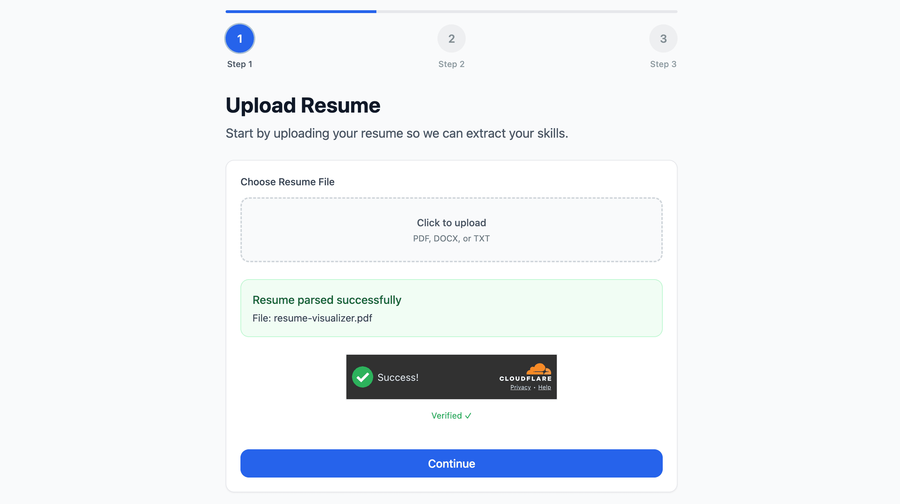
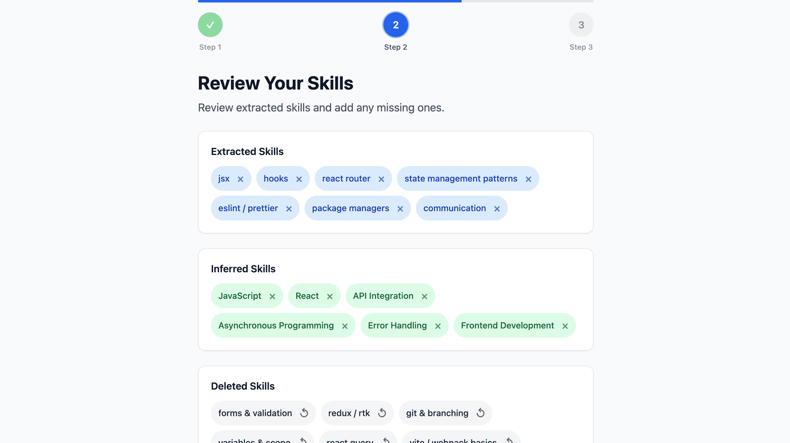
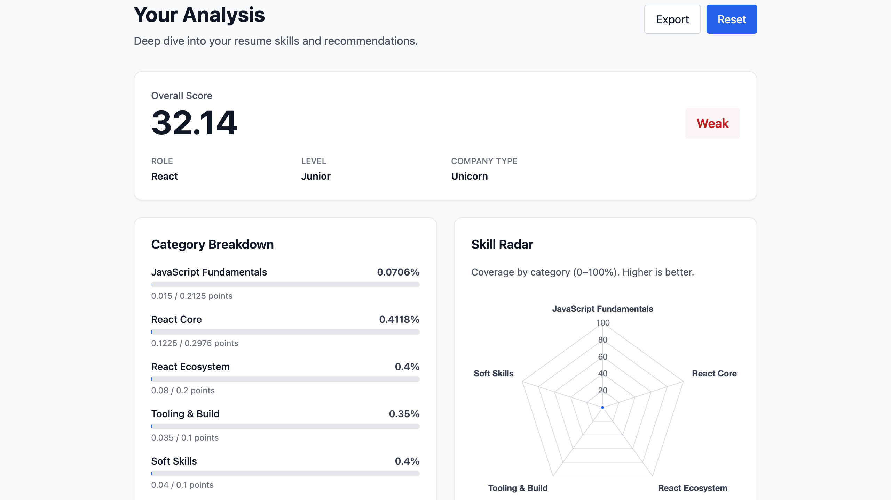

# Skill Gap Visualizer

Frontend app that lets you upload a resume, extract skills, and benchmark against a target role to get strengths, gaps, and a personalized improvement plan.

## What this does
- Upload a resume (PDF/DOCX/TXT) and extract skills.
- Review and edit extracted + inferred skills.
- Benchmark against a target role, level, and company type.
- Show strengths, weaknesses, priorities, and category coverage.

## Why I built it
- Candidates often don’t know which skills they’re missing for a target role.
- Manual gap analysis is slow and inconsistent.
- I wanted a fast, reliable flow with clear UX states (loading, empty, error).

## Features
- Resume upload (PDF/DOCX/TXT) and text extraction
- Review/edit extracted and inferred skills
- Benchmark by role, level, and company type
- Analysis view with strengths, weaknesses, and priorities

## Tech Stack
- React + Vite
- Tailwind CSS
- React Router

## Demo
Screenshots:





## Deployment
Live: [skill-gap-visualizer.vercel.app](https://skill-gap-visualizer.vercel.app)

## Setup
```bash
npm install
npm run dev
```

## Environment
Create a `.env` file (or use `.env.example`):
```
VITE_USE_MOCK_API=true
VITE_API_BASE=
VITE_TURNSTILE_SITE_KEY=
```

## Scripts
```bash
npm run dev
npm run build
npm run preview
npm run lint
```

## Limitations & Roadmap
- Backend benchmarks are currently limited to React + Unicorn (Junior/Senior).
- Expand benchmarks to more roles, levels, and company types.
- Add richer charts and ATS insights as backend coverage grows.

## Notes
- When `VITE_USE_MOCK_API=false`, the app expects backend endpoints at:
  - `POST /api/extract`
  - `POST /api/analyze-resume`
- For backend request/response contracts, see `FRONTEND-INTEGRATION.md`.
